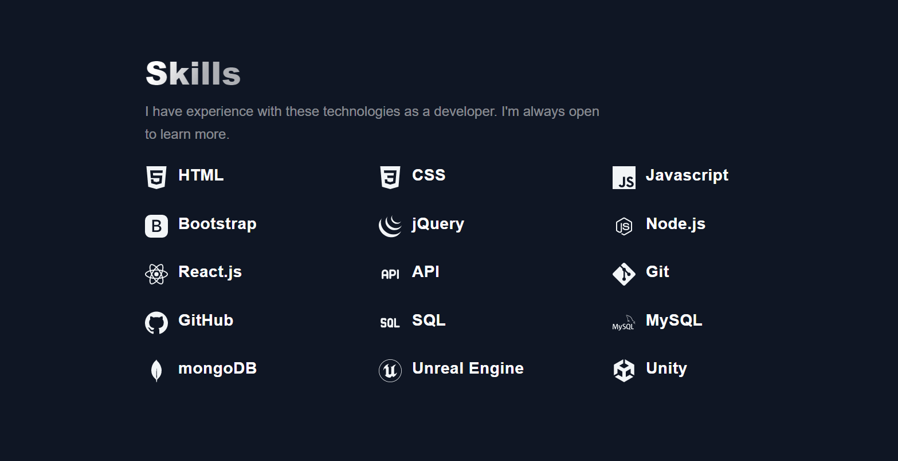

# Personal portfolio page
It's a personal portfolio page to showcase my skills and projects in the IT field. The Website was built with React + Tailwind CSS. The informations on this page are Up to date.

## Features
- About Me
- Skills
- Contact
- Projects
## Screenshots


## Run Locally
Clone my repository
```bash
  git clone https://github.com/istvanszasz99/portfolio.git
```

Go to the project directory
```bash
  cd portfolio
```

Install dependencies
```bash
  npm install
```

Start the server
```bash
  npm run dev
```

## Preview
https://istvanszasz99.github.io/portfolio/

## Author
- [@istvanszasz99](https://www.github.com/istvanszasz99)
